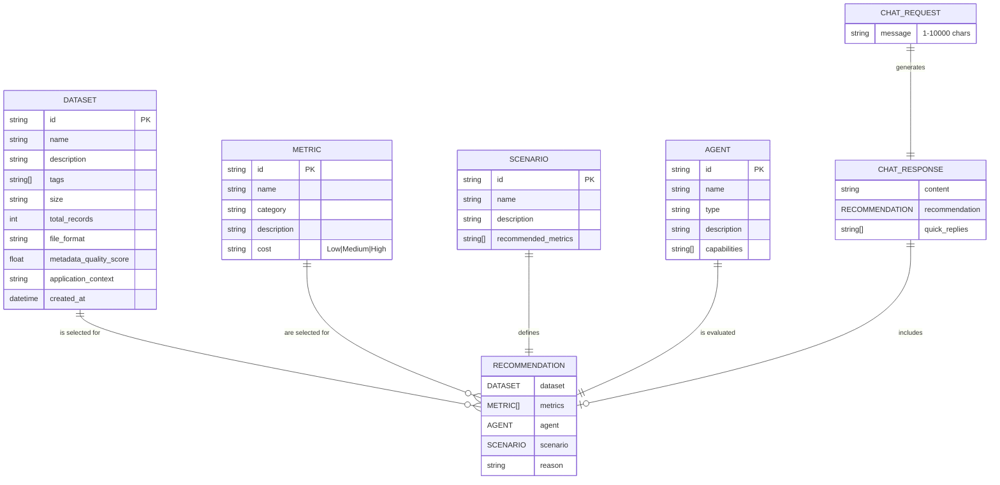

# AEval Backend Architecture Documentation

## Table of Contents

1. [System Overview](#system-overview)
2. [Component Architecture](#component-architecture)
3. [Data Models](#data-models)
4. [Class Diagrams](#class-diagrams)
5. [State Machines](#state-machines)
6. [Deployment Architecture](#deployment-architecture)
7. [Security Architecture](#security-architecture)
8. [Evolution Roadmap](#evolution-roadmap)

---

## System Overview

### High-Level Architecture


### Technology Stack

| Layer | Technology | Purpose |
|-------|-----------|---------|
| **API Framework** | FastAPI 0.104+ | High-performance async API |
| **Validation** | Pydantic v2 | Data validation and serialization |
| **LLM Client** | zhipuai 2.1.5+ | z.ai API integration |
| **Configuration** | pydantic-settings | Environment-based settings |
| **Testing** | pytest | Unit and integration tests |
| **Server** | uvicorn | ASGI server |

---

## Component Architecture

### Module Structure


### Component Responsibilities

#### main.py
- **Responsibility**: Application bootstrap
- **Dependencies**: None (root module)
- **Functions**:
  - Initialize FastAPI app
  - Configure CORS
  - Register routers

#### config.py
- **Responsibility**: Configuration management
- **Dependencies**: pydantic-settings
- **Functions**:
  - Load from .env file
  - Type-safe settings access
  - Default value handling

#### models/
- **Responsibility**: Data contracts
- **Dependencies**: Pydantic
- **Functions**:
  - Request/response validation
  - JSON serialization/deserialization
  - Type hints and IDE support

#### services/
- **Responsibility**: Business logic
- **Dependencies**: Models, agents
- **Functions**:
  - Data loading with caching
  - Request orchestration
  - Singleton lifecycle management

#### agents/
- **Responsibility**: AI/LLM integration
- **Dependencies**: zhipuai, models
- **Functions**:
  - Prompt engineering
  - LLM API communication
  - Response parsing and validation

#### api/
- **Responsibility**: HTTP interface
- **Dependencies**: Services, models
- **Functions**:
  - Request validation
  - Error handling
  - Response formatting

---

## Data Models

### Entity Relationship Diagram



### Model Hierarchy


---

## Class Diagrams

### Service Layer Classes


### API Layer Classes


---

## State Machines

### Chat Service Lifecycle


### Data Service Cache States


### Request Processing States


---

## Deployment Architecture

### Development Environment


### Production Deployment (Future)


### Docker Deployment (Future)


---

## Security Architecture

### Current Security Model


### Future Security Enhancements


---

## Evolution Roadmap

### Phase 1: Current (Prototype)


### Phase 2: Database Migration


### Phase 3: Multi-Agent Architecture


### Phase 4: Full Microservices


---

## Design Patterns Used

### 1. Singleton Pattern
```mermaid
classDiagram
    class ChatService {
        -static ChatService _chat_service
        -__init__()
        +static get_chat_service() ChatService
    }

    note for ChatService
        Single instance shared across
        all requests for efficiency
    end note
```

### 2. Repository Pattern (Future)


### 3. Factory Pattern (Future)
```mermaid
classDiagram
    class AgentFactory {
        <<static>>
        +create_agent(type) Agent
    }

    class Agent {
        <<abstract>>
        +process()
    }

    class IntentAgent {
        +process()
    }

    class RecommendationAgent {
        +process()
    }

    AgentFactory --> Agent
    Agent <|-- IntentAgent
    Agent <|-- RecommendationAgent
```

---

## Performance Considerations

### Current Performance Characteristics

| Component | Operation | Avg Time | Bottleneck |
|-----------|-----------|----------|------------|
| DataService | load_datasets() | 5-10ms | File I/O |
| DataService | load_metrics() | 5-10ms | File I/O |
| EvaluationAgent | LLM API call | 15-25s | Network/LLM |
| ChatService | Total request | 15-25s | LLM API |

### Optimization Opportunities

```mermaid
graph TB
    subgraph "Current"
        C1[Sync File I/O] --> C2[No Caching]
        C2 --> C3[Single LLM Call]
    end

    subgraph "Optimizations"
        O1[Async File I/O<br/>aiofiles]
        O2[Redis Cache<br/>TTL: 1hr]
        O3[Streaming Response<br/>SSE/WebSocket]
        O4[Request Batching<br/>N>1 requests]
    end

    C1 -.->|Upgrade to| O1
    C2 -.->|Add| O2
    C3 -.->|Enable| O3
    C3 -.->|Implement| O4

    style O1 fill:#c8e6c9
    style O2 fill:#fff9c4
    style O3 fill:#e1f5fe
    style O4 fill:#f3e5f5
```

---

## Monitoring & Observability (Future)

### Metrics to Track

```mermaid
graph TB
    subgraph "Application Metrics"
        QPS[Queries Per Second]
        Latency[Request Latency<br/>p50, p95, p99]
        Error[Error Rate<br/>4xx, 5xx]
        Active[Active Requests]
    end

    subgraph "Business Metrics"
        Intent[Intent Accuracy]
        Rec[Recommendation Success]
        User[User Satisfaction]
    end

    subgraph "Infrastructure Metrics"
        CPU[CPU Usage]
        Mem[Memory Usage]
        Disk[Disk I/O]
        Net[Network I/O]
    end

    subgraph "LLM Metrics"
        Token[Token Usage]
        LLM_Latency[LLM Latency]
        Cost[API Cost]
    end

    style QPS fill:#c8e6c9
    style Latency fill:#fff9c4
    style Error fill:#ffcdd2
    style Token fill:#e1f5fe
```

---

## Appendix

### File Reference

| File | Lines of Code | Purpose |
|------|---------------|---------|
| `main.py` | 26 | FastAPI bootstrap |
| `config.py` | 30 | Configuration |
| `models/dataset.py` | 23 | Dataset model |
| `models/metric.py` | 15 | Metric model |
| `models/scenario.py` | 16 | Scenario model |
| `models/agent.py` | 17 | Agent model |
| `models/recommendation.py` | 39 | Request/Response models |
| `services/data_service.py` | 107 | Data loading |
| `services/chat_service.py` | 61 | Chat orchestration |
| `agents/evaluation_agent.py` | 232 | LLM agent |
| `api/chat.py` | 35 | Chat endpoint |

### Total Lines of Code

```
Language      Files    Lines    Code    Comments    Blanks
──────────────────────────────────────────────────────────
Python           11      601      450          50        101
JSON             4       200      200           0          0
──────────────────────────────────────────────────────────
Total            15      801      650          50        101
```

---

**Document Version**: 1.0.0
**Last Updated**: 2026-02-03
**Maintainer**: AEval Backend Team
