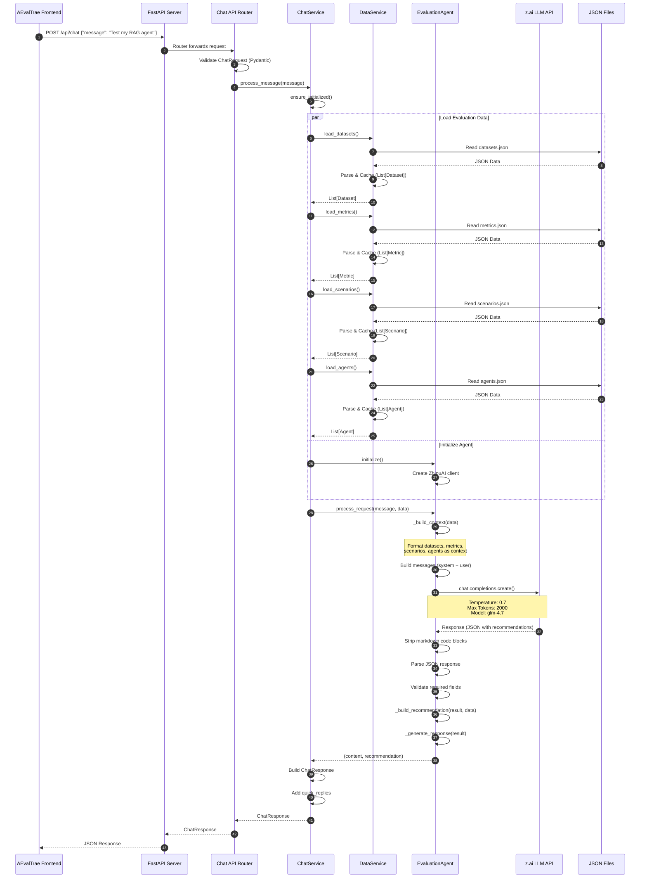
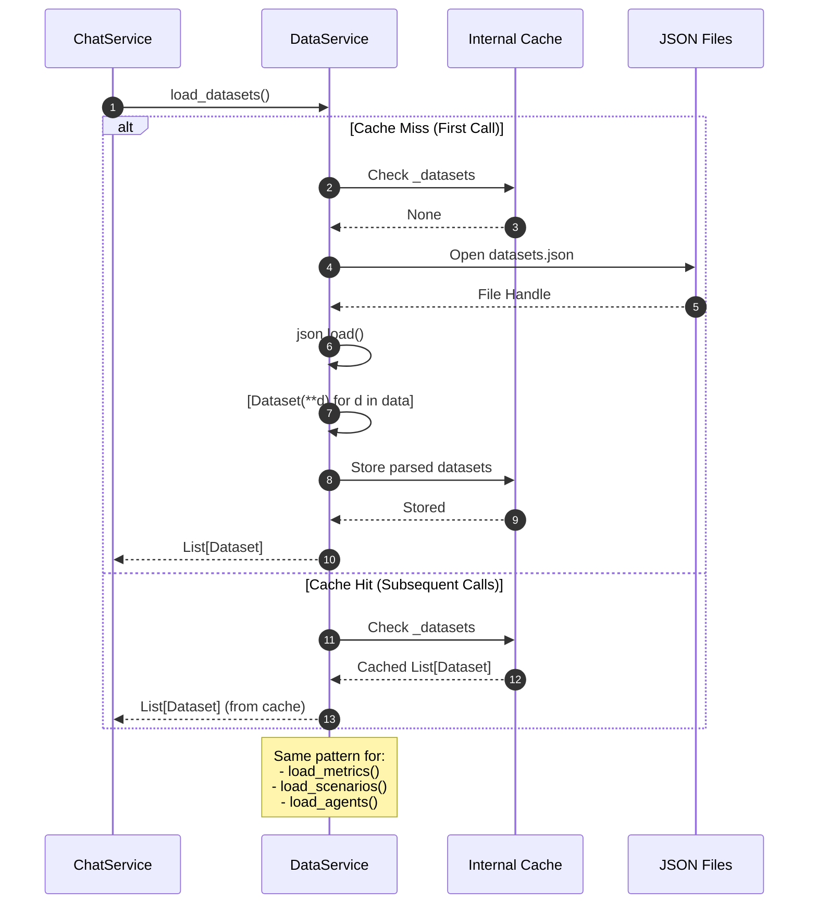
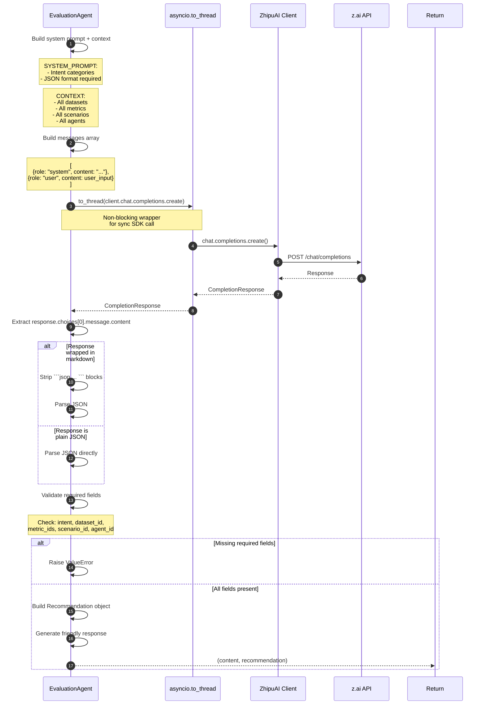
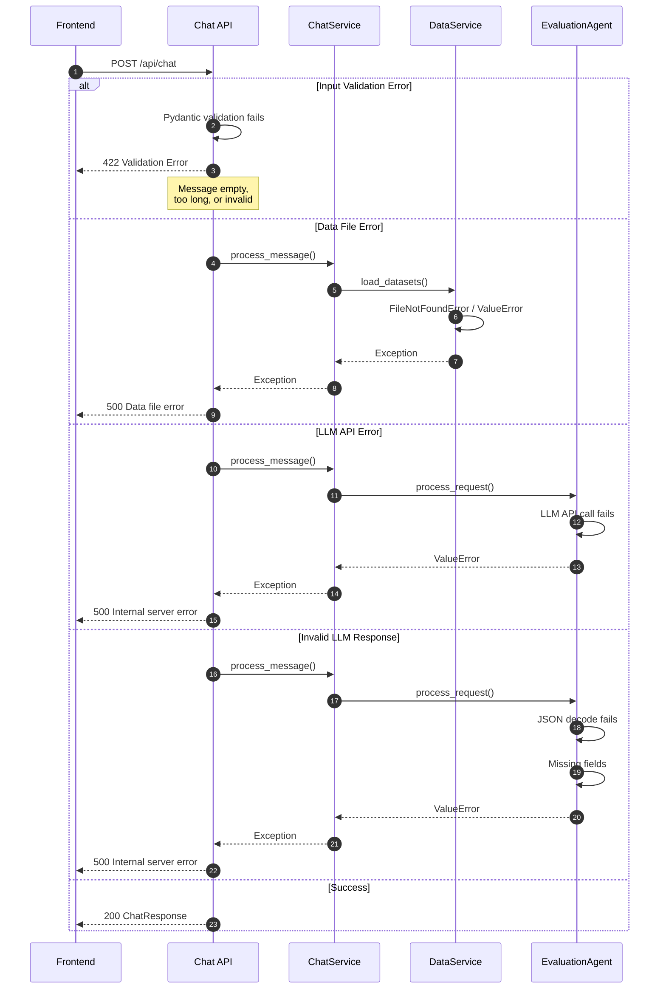
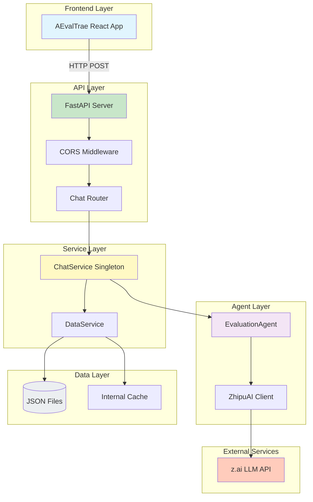

# AEval Backend

AI-Assisted Evaluation Configuration Backend - A Python FastAPI backend that provides AI-powered intent extraction and evaluation configuration recommendations.

## Features

- **AI-Powered Chat**: Uses z.ai API (OpenAI-compatible) for intelligent conversation
- **Intent Extraction**: Automatically classifies user evaluation goals
- **Smart Recommendations**: Suggests appropriate datasets, metrics, scenarios, and agents
- **RESTful API**: Clean FastAPI endpoints with automatic OpenAPI documentation
- **Async Support**: Built on async/await for high performance

## Project Structure

```
backend/
├── app/
│   ├── __init__.py
│   ├── main.py              # FastAPI application entry
│   ├── config.py            # Configuration (env vars, settings)
│   ├── models/              # Pydantic models
│   │   ├── __init__.py
│   │   ├── dataset.py
│   │   ├── metric.py
│   │   ├── scenario.py
│   │   ├── agent.py
│   │   └── recommendation.py
│   ├── services/            # Business logic
│   │   ├── __init__.py
│   │   ├── data_service.py  # Data loading service
│   │   └── chat_service.py # Chat orchestration service
│   ├── agents/              # AI agents
│   │   ├── __init__.py
│   │   └── evaluation_agent.py
│   └── api/                 # API endpoints
│       ├── __init__.py
│       └── chat.py          # Chat endpoint
├── tests/                   # Test suite
│   ├── __init__.py
│   ├── fixtures.py
│   ├── test_agents.py
│   └── test_api.py
├── data/                    # Initial data
│   ├── datasets.json
│   ├── metrics.json
│   ├── scenarios.json
│   └── agents.json
├── requirements.txt
├── pyproject.toml
└── .env.example
```

## Setup Instructions

### Prerequisites

- Python 3.10 or higher
- pip or poetry
- z.ai API key

### Installation

1. **Create virtual environment**
   ```bash
   cd backend
   python -m venv venv
   ```

2. **Activate virtual environment**
   ```bash
   # On Linux/Mac
   source venv/bin/activate

   # On Windows
   venv\Scripts\activate
   ```

3. **Install dependencies**
   ```bash
   pip install -r requirements.txt
   ```

4. **Configure environment variables**
   ```bash
   cp .env.example .env
   ```

   Edit `.env` and add your z.ai API credentials:
   ```env
   ZAI_API_KEY=your_actual_api_key_here
   ZAI_BASE_URL=https://api.z.ai/v1
   ZAI_MODEL=gpt-4o-mini
   ```

5. **Run the server**
   ```bash
   uvicorn app.main:app --reload --host 0.0.0.0 --port 8000
   ```

   The API will be available at `http://localhost:8000`

   Interactive API docs: `http://localhost:8000/docs`

## Request Flow Architecture

### Complete Chat Request Sequence



### Data Loading & Caching Flow



### LLM Interaction Detail



### Error Handling Flow



### Component Interaction Overview



## API Endpoints

### Health Check
```
GET /health
```

Returns server health status.

### Chat
```
POST /api/chat
Content-Type: application/json

{
  "message": "Test my RAG agent for safety"
}
```

Returns AI response with evaluation configuration recommendation.

## Running Tests

```bash
# Run all tests
pytest tests/ -v

# Run with coverage report
pytest tests/ --cov=app --cov-report=html

# Run specific test file
pytest tests/test_agents.py -v
```

## Frontend Integration

The frontend (AEvalTrae) connects to this backend via the `/api/chat` endpoint.

To run the full stack:

1. Start the backend:
   ```bash
   cd aeval-backend/backend
   source venv/bin/activate
   uvicorn app.main:app --reload --host 0.0.0.0 --port 8000
   ```

2. Start the frontend (in another terminal):
   ```bash
   cd AEvalTrae
   npm install
   npm run dev
   ```

3. Open `http://localhost:5173` in your browser

## Configuration

Environment variables (see `.env.example`):

| Variable | Description | Default |
|----------|-------------|---------|
| `ZAI_API_KEY` | z.ai API key | *Required* |
| `ZAI_BASE_URL` | z.ai API base URL | `https://api.z.ai/v1` |
| `ZAI_MODEL` | Model to use | `gpt-4o-mini` |
| `API_HOST` | API host | `0.0.0.0` |
| `API_PORT` | API port | `8000` |
| `AGENT_TEMPERATURE` | LLM temperature | `0.7` |
| `AGENT_MAX_TOKENS` | Max tokens for LLM response | `2000` |
| `DATA_DIR` | Data directory | `data` |

## Development

### Code Style

The project uses:
- **Black** for code formatting
- **Ruff** for linting

Format code:
```bash
black app/ tests/
```

Lint code:
```bash
ruff check app/ tests/
```

### Adding New Data

To add new datasets, metrics, scenarios, or agents, edit the JSON files in the `data/` directory:

- `data/datasets.json` - Evaluation datasets
- `data/metrics.json` - Evaluation metrics
- `data/scenarios.json` - Evaluation scenarios
- `data/agents.json` - AI agent configurations

The backend automatically loads these files on startup.

## Troubleshooting

### "Module not found" errors
Make sure the virtual environment is activated and dependencies are installed:
```bash
source venv/bin/activate
pip install -r requirements.txt
```

### "Connection refused" from frontend
1. Check that the backend is running on port 8000
2. Verify `VITE_API_URL` in frontend `.env.local` matches backend URL
3. Check browser console for CORS errors

### API key errors
1. Verify `ZAI_API_KEY` is set in `.env` file
2. Check that the API key is valid and active
3. Ensure `ZAI_BASE_URL` is correct for your provider

## License

MIT
